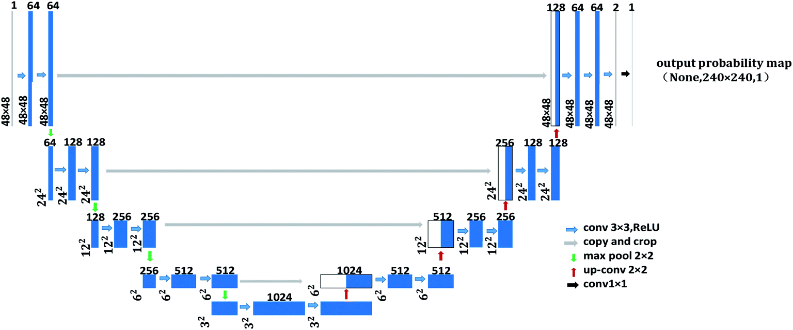

# Deep-learning-pipeline-for-radiology-department-of-UZ-Leuven-Hospital
## Background:
Delineation of brain tumors is an important task for the diagnosis and treatment monitoring of brain tumors. This task is carried out by expert radiologists trained in the process. However, it is considered tedious, time consmuing and prone to human error.
## Goal:
  The goal of this project was to develop an end-to-end clinical workflow to automate the task of delineation of the brain tumor that starts from the acquisition of the different MRI modalities and ends with displaying the delineation on the radiology workstation. A Convolutional Neural Networks (CNN) trained on a public dataset and validated on the hospital data was used for the delineation process.  
    The project was realized with collaboration of the medical imaging research center (MIRC) of the radiology department of UZ Leuven hospital as part of the course "Design in Medical Technology"
    
## Project requirements:
  

  

## Implementation:  
  ### 1) Neural Network training
  **U-Net architecture was used for segmentation:**      

   
  
  **Training parameters:**  
    

  
  
  **Visualization of predicted tumor mask VS ground truth:**  

    
   

  
  ### 2) Pre-processing:  
  
   **Pre-processing pipeline: Preprocessing the data before feeding it to the network**  

   
  ### 3) Pre-processing:  
  
  **Post-processing pipeline: Postporcessing the output of the network in order to convert it to a suitable format for visualization and modification on
  the radiology workstation**  

   
     
   **Visualization of final RTSTRUCT contours overlaid over the GT. The radiologist will be able to visualize and modify the contours if needed
   .The modified version will be sent back to the network to fine-tune it and increase its robustness:**  
 
   
   ### 4) Final proposed pipeline that closes the loop between pre-processing and post-processing:  
   

   
 
 
   
   
  

